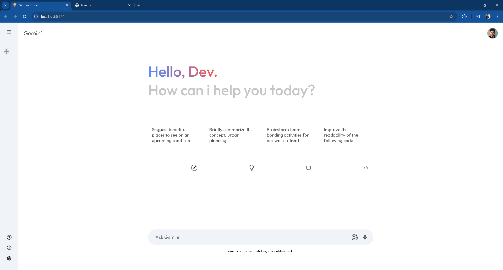

# 🌟 Gemini Clone App — ReactJS + Gemini 1.5 Flash 🤖✨

Hello! 👋  
This is a **Gemini-inspired AI Chat App** built using **React + Vite**, powered by **Google's Gemini 1.5 Flash model** via API. The UI emulates the clean and intuitive feel of Gemini, allowing users to chat with an LLM in a sleek, interactive interface.

> 🚧 This is a **work-in-progress learning project**, focused on mastering real-world React skills, LLM integration, and app structuring.

---

## 🎯 Project Goals

- 🔥 Integrate Gemini 1.5 Flash model for AI-powered chat
- ⚛️ Deepen understanding of React and component architecture
- 🧠 Use Context API to manage global state cleanly
- 🎨 Build a visually polished clone UI that feels modern and user-friendly

---

## 🖥️ App Preview



> ✨ Type messages, and get AI-powered responses instantly — all styled to match Gemini's real UI.

---

## 🧠 Key Features

- ✅ **Gemini API Integration** (gemini-1.5-flash)
- ✅ **Modern UI** with custom icons and layout
- ✅ **Context API** for managing shared state (like messages)
- ✅ **Dynamic Sidebar** for navigation
- ✅ **Component-Based Architecture** for clean code
- ✅ **Vite** for fast dev experience
- ✅ **Responsive CSS Styling**

---

## 📁 Project Structure (Simplified)

```bash
gemini-clone-react-app/
├── public/
│   └── vite.svg                  # Static file
├── src/
│   ├── App.jsx                   # Root component
│   ├── main.jsx                  # Entry point
│   ├── index.css                 # Global styles
│   ├── assets/                   # Images/icons
│   ├── components/
│   │   ├── Sidebar/Sidebar.jsx   # Sidebar UI
│   │   └── main/Main.jsx         # Chat interface
│   ├── config/gemini.js          # Gemini API logic
│   └── context/Context.jsx       # App-wide state
├── index.html
├── vite.config.js
├── package.json
└── README.md
````

---

## 🚀 Getting Started

### 1. Clone the Repo

```bash
git clone https://github.com/varunnnnsonii/gemini-clone-react-app.git
cd gemini-clone-react-app
```

### 2. Install Dependencies

```bash
npm install
```

### 3. Add Your API Key

Update `src/config/gemini.js` and add your Gemini API key (you can store it in `.env` if preferred).

```js
const API_KEY = "your-gemini-api-key-here";
```

### 4. Start the Development Server

```bash
npm run dev
```

> 🔗 Open [http://localhost:5173](http://localhost:5173) in your browser to view the app.

---

## 🧩 Tech Stack

* ⚛️ React 18
* ⚡ Vite
* 💬 Gemini 1.5 Flash (API)
* 🎨 CSS for UI styling
* 🔌 Context API
* 🖼️ Custom PNG + SVG icons

---

## 🚧 What's Next (Planned Features)

These are features I’m actively working on next to enhance UX and state handling:

* [ ] 💾 Save chat history in `localStorage`
* [ ] 🧵 Session-based sidebar with previous chats
* [ ] 🤝 Resubmit chat history to Gemini for context-rich responses

---

## 🧠 What I’m Learning Through This

* 📡 API integration using fetch
* 🧠 Global state via Context API
* 🧱 Component structuring in React
* 🎨 UI layout using flex/grid
* 🔁 Handling user inputs + response logic

---

## ⭐ Give This Repo a Star! ⭐

If you like this project and find it useful or interesting, please consider giving it a ⭐ star!
Your support means a lot and motivates me to keep improving and building more awesome projects!

---

## ❗ License

This project is **not licensed**.
Feel free to explore the code and learn, but redistribution or reuse without permission is not allowed.

---

## 🙌 Final Thoughts

> I’m using this project to **level up my React and AI integration skills**, and each update pushes me to explore better ways to write clean, responsive, and intelligent interfaces.

Made with ❤️ and caffeine by [Varun](https://github.com/varunnnnsonii)

---

